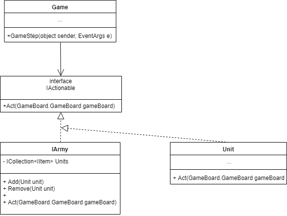
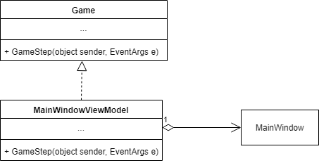

# RPG
## Описание игры
Имеются 2 враждующие армии. Каждая армия состоит из лучника, человека-огня, человека-льда. Игра происходит на клеточном поле. Игрок выбирает роль и уровень сложности. Цель - уничтожить армию противника.

Управление осуществляется кнопками клавиатуры: w, a, s, d - движение вверх, влево, вниз, вправо; пробел - удар по врагу, стоящему в соседней по стороне клетке. Остальные персонажи делают шаги автоматически.
## Как запустить?
Склонировать проект. Собрать с помощью Visual Studio и запустить.
## Паттерны
### Порождающие паттерны
#### Строитель
Применяется для создани игрового поля. В зависиимости от уровня строителем управляют разные директоры.  
#### Фабрика
Состав армии можно модифицировать: изменять количество и тип солдат. В этом и помогает фабрика.

Также у конкретного персонажа есть свое конкретное оружие: лук - у лучника, огонь - у человека-огня, лед - у человека-льда.

### Структурные паттерны
#### Компановщик
В роли компановщиков выступают армии, которые содержат в себе солдат.

#### Адаптер
В качестве адаптера выступает ViewModel. Она связывает логику игры и интерфейс.

#### Мост
На две иерархии были разделены юниты и действия, которые они выполняют.

### Поведенческие паттерны
#### Стратегия
Выбор действия(атаковать или идти) в зависимости от того, находится ли сейчас по близости враг.

#### Команда
Непосредственное действие, которое выполняет объект - это и есть команда.
#### Наблюдатель
Элементы View с помощью технологии binding подписываются на элементы ViewModel.

### Дополнительно
#### Внедрение зависимостей
Зашит непостредственно во фреймворк prism. Используется для показал окон и управления ViewLauncher'ом.
